PRATIKUM 5 PEMROGRAMAN WEB

TUGAS INI DIBUAT UNTUK MEMENUHI TUGAS PERTEMUAN 5

Nama    : Mulifatkhul Rachiim

NIM     : 312010180

Kelas   : TI.20.B1

Langkah Pratikum 
1. Buatlah dokumen HTML kemudian Membuat  Box Element 

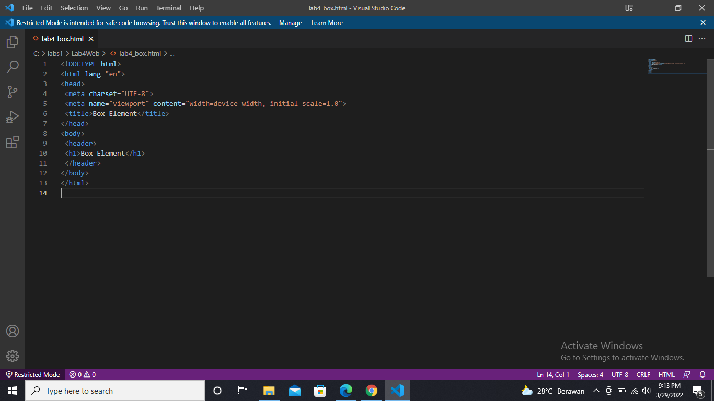

kemudian tambahkan kode untuk membuat tag vid

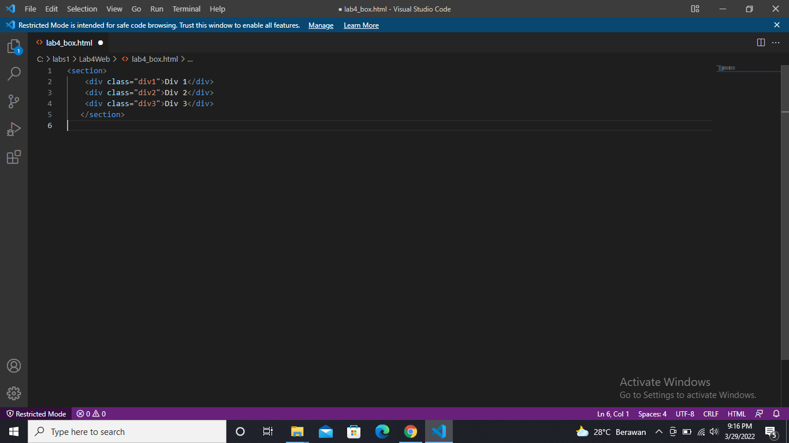

Selanjutnya tambahkan deklarasi CSS pada head untuk membuat float element, seperti berikut.

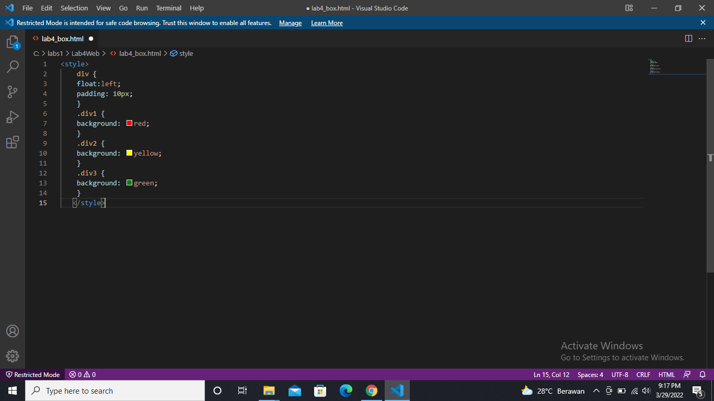

kemudian buka browser untuk melihat hasilnya

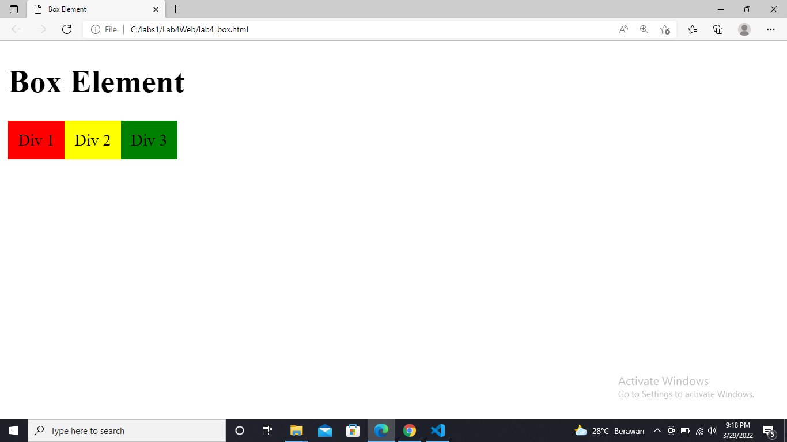

2. Mengatur Clearfix Element

Tambahkan element div lainnya seteleah div3 seperti berikut,Kemudian atur property clear pada CSS, 
seperti berikut

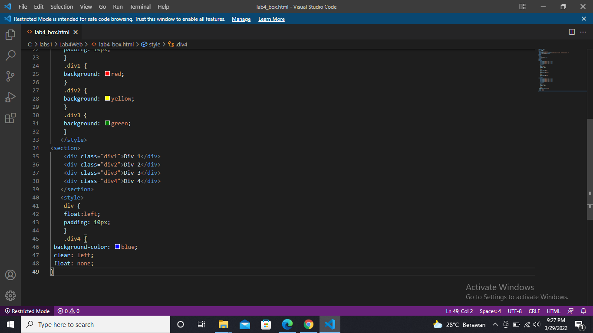

kemudian disave dan refrseh kembali di browser

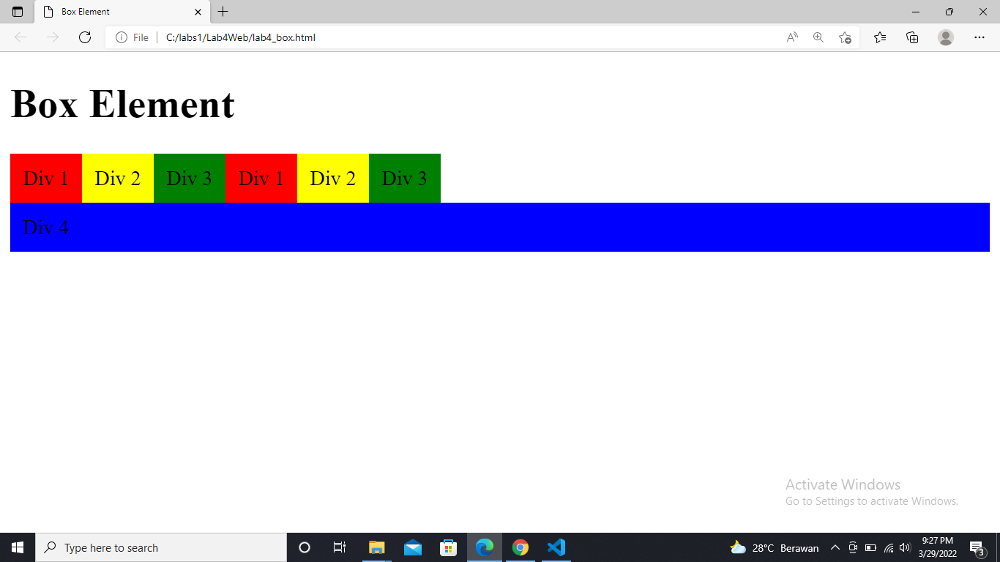

3 kemudian buatlah file baru didalamnya dengan nama home.html, dan file css dengan nama style.css.

Kemudian tambahkan kode CSS untuk membuat layoutnya.
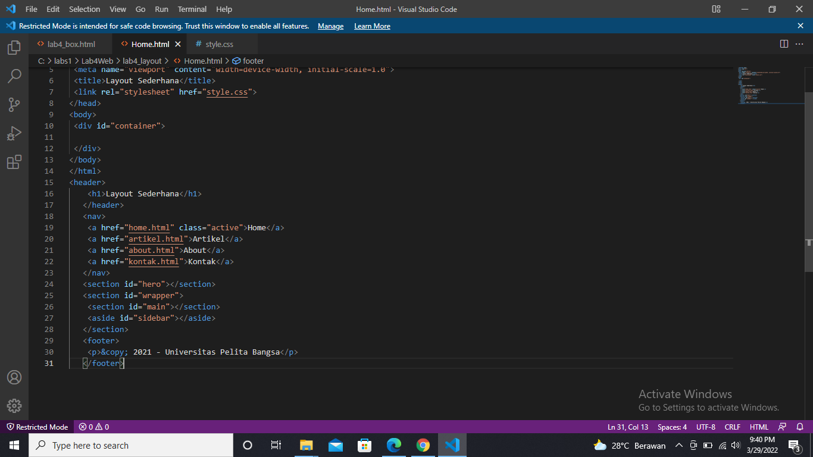

Kemudian selanjutnya mengatur navigasi.
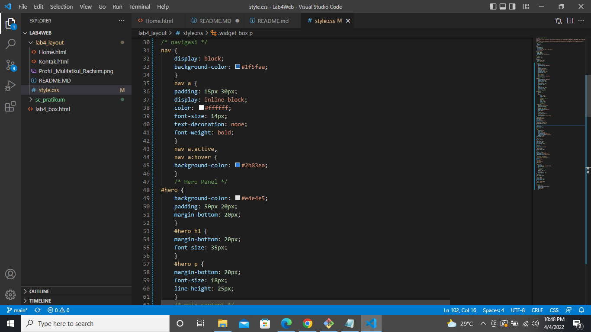

4. Membuat Hero Panel.
Selanjutnya membuat hero panel. Tambahkan kode HTML dan CSS seperti berikut.
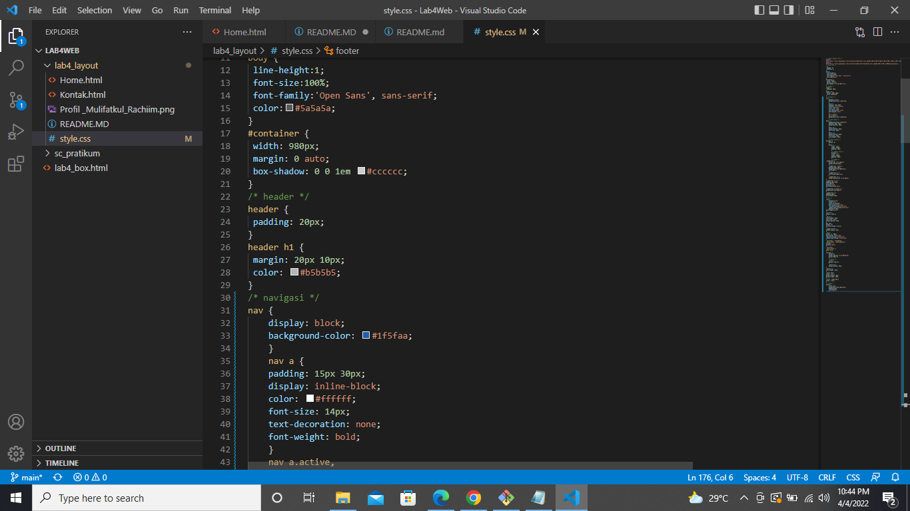

Mengatur Layout Main dan Sidebar
Selanjutnya mengatur main content dan sidebar, tambahkan CSS float.
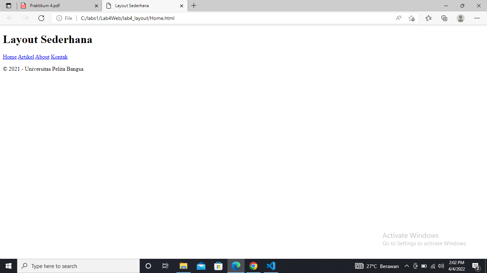

Selanjutnya membuat content artikel. Tambahkan HTML berikut pada main content
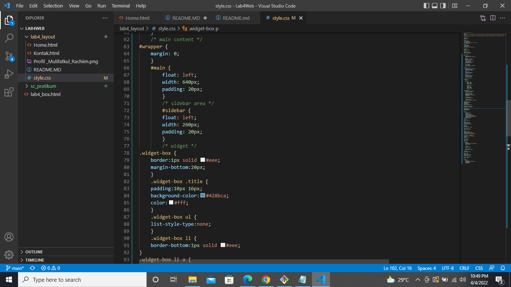

Pertanyaan dan tugas

1. Tambahkan Layout untuk menu About
=> buat single layout yang berisi deskripsi, portfolio, dl
2. Tambahkan layout untuk menu Contact
=> yang berisi form isian: nama, email, message, dll

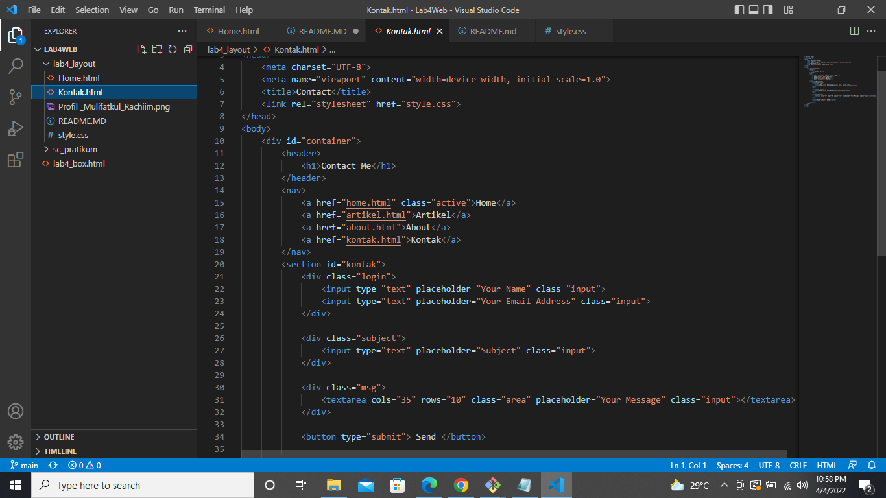

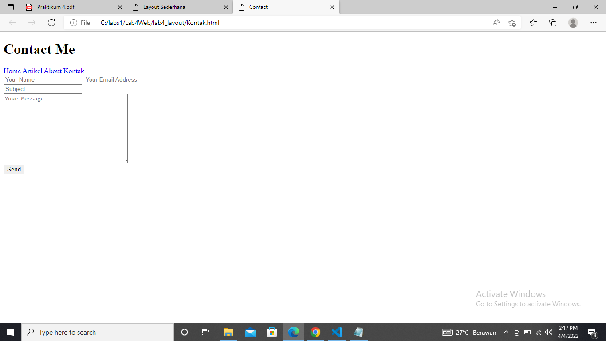

